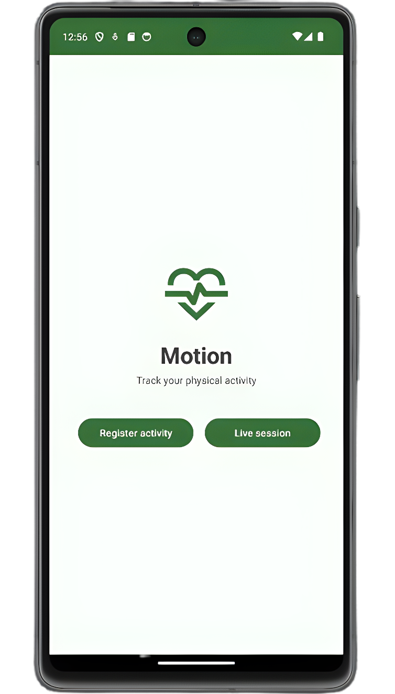
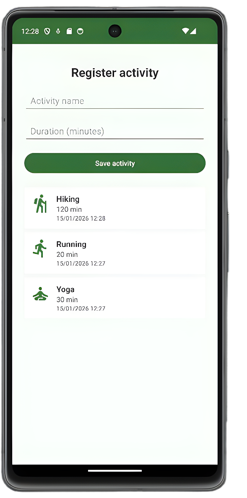
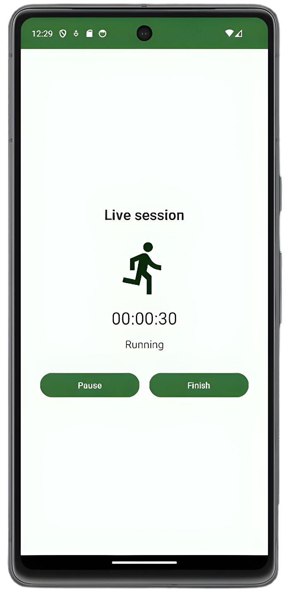
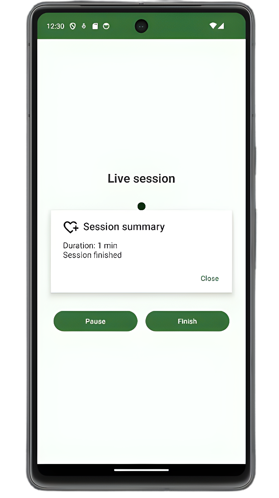

# 📱 MotionLog – Physical Activity Tracker

**MotionLog** is an Android application built with **Kotlin** that allows users to log and track physical activities either manually or in real time using the device’s **accelerometer sensor**.  
The app provides a simple and clean interface to register sessions and visualize them in a list.

## Features

- Home screen with navigation to different activity modes
  
- Manual activity logging:
  - Enter activity name and duration
  - Input validation
  - Automatic icon assignment based on activity type
  
- Live activity session using device sensors:
  - Real-time motion detection with the accelerometer
  - Movement classification (No movement, Walking, Running, Intense movement)
  - Chronometer with `HH:MM:SS` format
  - Start / Pause / Finish session controls
  
- Session summary dialog at the end of live tracking
- Activity list displayed using **RecyclerView**
- Clean and responsive user interface

## Technologies Used

- Kotlin  
- Android SDK  
- RecyclerView + Adapter  
- SensorManager & Accelerometer  
- Chronometer  
- AlertDialog  
- Intents & navigation between Activities  
- XML-based UI layouts

## App Preview

<table align="center" style="border-collapse: collapse; border: none;">
  <tr>
    <td align="center" style="border: none;">
       
      <b>Home</b>
    </td>
    <td align="center" style="border: none;">
       
      <b>Manual activity log</b>
    </td>
  </tr>
  <tr>
    <td align="center" style="border: none;">
       
      <b>Live session</b>
    </td>
    <td align="center" style="border: none;">
       
      <b>Session summary</b>
    </td>
  </tr>
</table>

## How to Run

1. Clone the repository:

       https://github.com/DelxMG/motion-tracker.git

3. Open the project in Android Studio

4. Build and run on an emulator or real device
